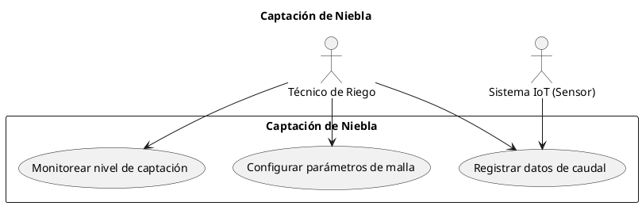
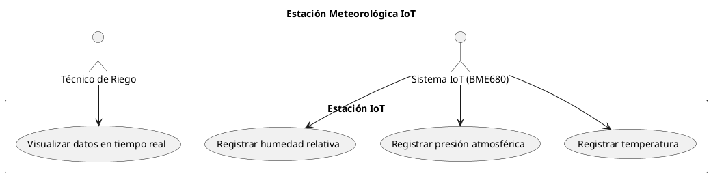
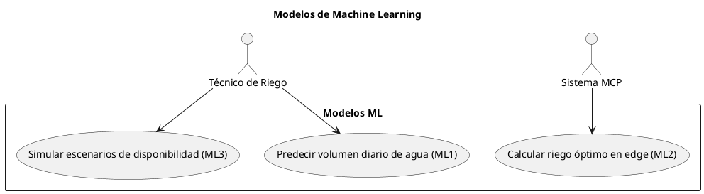
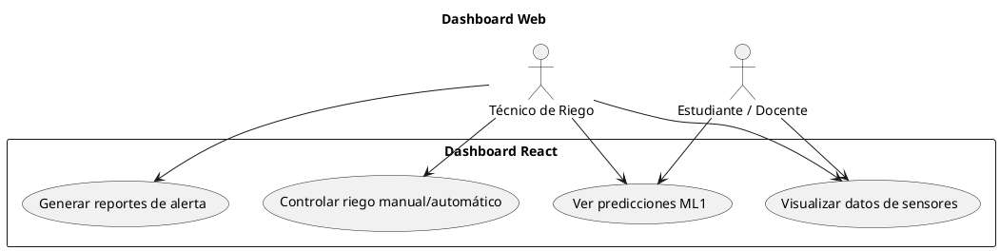
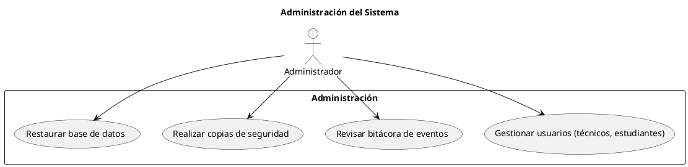
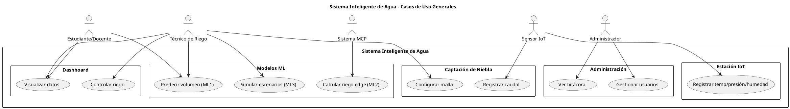

Perfecto. A continuación te entrego **todos los diagramas de casos de uso** de tu sistema inteligente de agua (atrapanieblas + IoT + ML + MCP + dashboard), **uno por uno**, en formato **PlantUML** con estilo profesional (actor, rectángulo de sistema, elipses). Cada diagrama incluye su código y su tabla descriptiva.

---

## 1. Diagrama de Casos de Uso: Captación de Niebla

**Código PlantUML:**

**Tabla descriptiva:**

| Elemento | Descripción |
|----------|-------------|
| **Nombre** | Captación de Niebla |
| **Actores** | Técnico de Riego, Sistema IoT (caudalímetro) |
| **Propósito** | Registrar y visualizar los datos de captación de agua de los atrapanieblas |
| **Descripción** | El sensor caudalímetro envía automáticamente los litros captados al servidor MCP. El técnico puede configurar parámetros de la malla (área, orientación) y consultar en tiempo real el nivel de captación. |

---

## 2. Diagrama de Casos de Uso: Estación Meteorológica IoT

**Código PlantUML:**

**Tabla descriptiva:**

| Elemento | Descripción |
|----------|-------------|
| **Nombre** | Estación Meteorológica IoT |
| **Actores** | Sistema IoT (sensor BME680), Técnico de Riego |
| **Propósito** | Recolectar datos ambientales (temperatura, presión, humedad) para alimentar los modelos ML |
| **Descripción** | El sensor BME680 envía lecturas cada 10 minutos al servidor local vía MCP. El técnico visualiza las variables en el dashboard. |

---

## 3. Diagrama de Casos de Uso: Modelos de Machine Learning (ML1, ML2, ML3)

**Código PlantUML:**

**Tabla descriptiva:**

| Elemento | Descripción |
|----------|-------------|
| **Nombre** | Modelos de Machine Learning |
| **Actores** | Técnico de Riego, Sistema MCP (servidor de interoperabilidad) |
| **Propósito** | Generar predicciones, control autónomo de riego en el borde y simulaciones prospectivas |
| **Descripción** | ML1 predice el volumen diario de agua captada usando datos históricos. ML2, ejecutándose en el ESP32, calcula la cantidad exacta de riego para los invernaderos. ML3 permite al técnico simular escenarios (ej. "si no llueve por 5 días, ¿cuánta agua tendré?"). |

---

## 4. Diagrama de Casos de Uso: Dashboard Web

**Código PlantUML:**

**Tabla descriptiva:**

| Elemento | Descripción |
|----------|-------------|
| **Nombre** | Dashboard Web |
| **Actores** | Técnico de Riego, Estudiante / Docente |
| **Propósito** | Visualizar toda la información del sistema en una interfaz amigable |
| **Descripción** | El técnico puede ver gráficos de caudal, recibir alertas de escasez, activar el riego manualmente o dejar que ML2 lo haga automático. Los estudiantes pueden explorar los datos históricos y predicciones con fines educativos. |

---

## 5. Diagrama de Casos de Uso: Administración del Sistema

**Código PlantUML:**

**Tabla descriptiva:**

| Elemento | Descripción |
|----------|-------------|
| **Nombre** | Administración del Sistema |
| **Actores** | Administrador |
| **Propósito** | Asegurar el correcto funcionamiento y seguridad del sistema |
| **Descripción** | El administrador registra técnicos y estudiantes, asigna roles, revisa los logs de acciones (quién activó el riego, etc.), y programa backups automáticos de la base de datos PostgreSQL. |

---

## 6. Diagrama General de Casos de Uso (integrados)

Si quieres un solo diagrama que muestre todos los módulos y sus relaciones con los actores, usa este código:

---

## Cómo generar los diagramas

1. Copia el código de cada diagrama (desde `@startuml` hasta `@enduml`).
2. Ve a [PlantUML Web Server](https://www.plantuml.com/plantuml/uml/) o usa la extensión de VS Code.
3. Pega el código y obtendrás la imagen PNG/SVG.
4. Inserta cada imagen en tu documento de Word/LaTeX con su respectiva tabla.

¿Necesitas que modifique algún actor, agregue relaciones `<<extend>>` o `<<include>>`, o que ajuste la descripción?